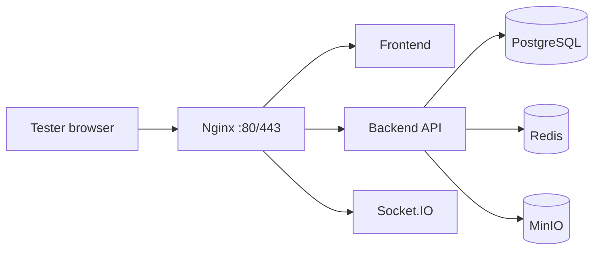

# AfyaSasa — Free Test Hosting Guide

This guide explains how to put AfyaSasa on the internet **for supervised testing** at **zero or near-zero cost**. It is written for the current Docker Compose stack in this repository (PostgreSQL, Redis, MinIO, NestJS backend, React frontend, Nginx).

> **Scope:** Testing and demos only — not production go-live. Change all default passwords, restrict access, and do not put real patient data on a free test server.

---

## Table of contents

1. [What you are hosting](#1-what-you-are-hosting)
2. [Choose your approach](#2-choose-your-approach)
3. [Prerequisites](#3-prerequisites)
4. [Option A — Oracle Cloud free VPS (recommended)](#4-option-a--oracle-cloud-free-vps-recommended)
5. [Option B — Cloudflare Tunnel (no open ports)](#5-option-b--cloudflare-tunnel-no-open-ports)
6. [Option C — Expose your local machine](#6-option-c--expose-your-local-machine)
7. [Production-style environment file](#7-production-style-environment-file)
8. [Harden the Docker stack for the internet](#8-harden-the-docker-stack-for-the-internet)
9. [HTTPS and custom domain](#9-https-and-custom-domain)
10. [Post-deploy verification](#10-post-deploy-verification)
11. [Share access with testers](#11-share-access-with-testers)
12. [Backups and resets](#12-backups-and-resets)
13. [Troubleshooting](#13-troubleshooting)
14. [Free tier limits and when to upgrade](#14-free-tier-limits-and-when-to-upgrade)
15. [Quick reference](#15-quick-reference)

---

## 1. What you are hosting

AfyaSasa runs as **six Docker services**:

| Service | Role | Default port (dev) |
|---------|------|-------------------|
| **nginx** | Public entry — serves UI and proxies `/api` + WebSockets | `8080` |
| **frontend** | Built React app (static files) | `5173` (internal) |
| **backend** | NestJS API + realtime | `3000` |
| **postgres** | Database | `5432` |
| **redis** | Sessions / cache | `6379` |
| **minio** | File storage (lab attachments, documents, radiology) | `9000` / `9001` |



**Minimum server specs for testing**

| Resource | Minimum | Recommended |
|----------|---------|-------------|
| CPU | 2 vCPU | 4 vCPU (ARM is fine) |
| RAM | 2 GB (+ 2 GB swap) | 4 GB+ |
| Disk | 20 GB | 40 GB+ |
| OS | Ubuntu 22.04 or 24.04 LTS | Same |

The full stack uses roughly **1.5–2.5 GB RAM** after first boot.

---

## 2. Choose your approach

| Approach | Cost | Difficulty | Best for |
|----------|------|------------|----------|
| **A. Oracle Cloud Always Free VM** | $0/month (always) | Medium | Best overall — full control, 24/7 uptime |
| **B. Cloudflare Tunnel on a VPS** | $0 (tunnel) + optional VPS | Medium | HTTPS without managing certificates |
| **C. Cloudflare Tunnel on your PC** | $0 | Easy | Short demos; PC must stay on |
| **D. Other free VPS** (GCP e2-micro, AWS free tier) | $0 for 12 months or limited | Medium | OK for short pilots; Oracle is more generous long-term |

**Not recommended for this app on free tiers**

- **Vercel / Netlify / GitHub Pages** — static frontend only; cannot run Postgres + Redis + MinIO + API.
- **Render / Railway free** — sleeps, limited RAM, managed DB costs extra; awkward for 6-service stack.
- **Shared cPanel hosting** — no Docker, no long-running Node/Postgres.

**Recommendation:** Use **Option A (Oracle Cloud free ARM VM)** for a stable test server you can share with your team for weeks. Use **Option C** if you only need a 1–2 hour demo today.

---

## 3. Prerequisites

On whichever machine will run Docker:

```bash
# Ubuntu — install Docker
sudo apt update
sudo apt install -y git ca-certificates curl
# Follow https://docs.docker.com/engine/install/ubuntu/ then:
sudo usermod -aG docker "$USER"
newgrp docker

docker --version
docker compose version
```

Clone the project:

```bash
git clone <your-repo-url> Afya-Sasa
cd Afya-Sasa
cp .env.example .env
```

---

## 4. Option A — Oracle Cloud free VPS (recommended)

Oracle’s **Always Free** tier includes an ARM VM (up to 4 OCPUs, 24 GB RAM) — enough to run the entire stack comfortably.

### Step 1 — Create an Oracle Cloud account

1. Go to [https://www.oracle.com/cloud/free/](https://www.oracle.com/cloud/free/)
2. Sign up (credit card may be required for verification; stay within Always Free resources to avoid charges).
3. Create a **Compute Instance**:
   - Shape: **Ampere A1** (ARM), 2–4 OCPUs, 12–24 GB RAM
   - Image: **Ubuntu 22.04** or **24.04**
   - Boot volume: 50 GB
   - Assign a **public IPv4**
   - Download the SSH private key

### Step 2 — Open firewall ports

**Oracle VCN security list** (cloud console):

| Direction | Port | Source | Purpose |
|-----------|------|--------|---------|
| Ingress | 22 | Your IP | SSH |
| Ingress | 80 | 0.0.0.0/0 | HTTP |
| Ingress | 443 | 0.0.0.0/0 | HTTPS |

**Ubuntu firewall on the VM:**

```bash
sudo apt install -y ufw
sudo ufw allow OpenSSH
sudo ufw allow 80/tcp
sudo ufw allow 443/tcp
sudo ufw enable
```

Do **not** expose ports `5432`, `6379`, `9000`, or `9001` to the internet.

### Step 3 — Install Docker on the VM

SSH in:

```bash
ssh -i ~/Downloads/ssh-key ubuntu@<YOUR_VM_PUBLIC_IP>
```

Install Docker (same as local testing guide), then clone the repo.

### Step 4 — Configure environment

Edit `.env` on the server (see [Section 7](#7-production-style-environment-file) for a full template).

At minimum, set:

```env
NODE_ENV=production
FRONTEND_ORIGIN=https://your-domain-or-ip

POSTGRES_PASSWORD=<long-random-string>
MINIO_ROOT_PASSWORD=<long-random-string>
S3_SECRET_ACCESS_KEY=<same-as-minio-or-separate>
JWT_ACCESS_SECRET=<64-char-random>
JWT_REFRESH_SECRET=<64-char-random>
```

Generate secrets:

```bash
openssl rand -hex 32
```

### Step 5 — Use production Docker Compose override

Create `docker-compose.prod.yml` next to `docker-compose.yml`:

```yaml
services:
  postgres:
    ports: []   # do not publish DB to host

  redis:
    ports: []

  minio:
    ports: []   # console not public

  backend:
    ports: []   # only reachable via nginx network

  frontend:
    ports: []

  nginx:
    ports:
      - "80:80"
      # add "443:443" when using Certbot (Section 9)
```

Start the stack:

```bash
docker compose -f docker-compose.yml -f docker-compose.prod.yml up -d --build
```

Wait ~60 seconds, then check:

```bash
docker compose ps
curl -fsS http://localhost/api/v1/health
```

### Step 6 — Point a domain (optional)

1. Buy a cheap domain, or use a subdomain you already own.
2. Add an **A record** → your VM public IP.
3. Enable HTTPS (Section 9).
4. Update `FRONTEND_ORIGIN` to `https://emr.yourdomain.com` and restart backend:

```bash
docker compose -f docker-compose.yml -f docker-compose.prod.yml up -d --build backend
```

### Step 7 — Verify

```bash
FRONTEND_URL=http://<YOUR_IP> BACKEND_URL=http://<YOUR_IP>/api/v1 npm run smoke
```

Open in browser: `http://<YOUR_IP>` or `https://your-domain`.

---

## 5. Option B — Cloudflare Tunnel (no open ports)

Use this when you want **free HTTPS** and **no port 80/443 forwarding** on your router or cloud firewall.

### On a VPS or home server

1. Create a free [Cloudflare](https://dash.cloudflare.com) account.
2. Add your domain to Cloudflare (free plan).
3. Install `cloudflared` on the server:

```bash
# Ubuntu — see https://developers.cloudflare.com/cloudflare-one/connections/connect-networks/downloads/
curl -fsSL https://pkg.cloudflare.com/cloudflare-main.gpg | sudo tee /usr/share/keyrings/cloudflare-main.gpg >/dev/null
echo 'deb [signed-by=/usr/share/keyrings/cloudflare-main.gpg] https://pkg.cloudflare.com/cloudflared jammy main' | sudo tee /etc/apt/sources.list.d/cloudflared.list
sudo apt update && sudo apt install -y cloudflared
```

4. Authenticate and create a tunnel:

```bash
cloudflared tunnel login
cloudflared tunnel create afyasasa-test
```

5. Create `/etc/cloudflared/config.yml`:

```yaml
tunnel: <TUNNEL_UUID>
credentials-file: /root/.cloudflared/<TUNNEL_UUID>.json

ingress:
  - hostname: emr.yourdomain.com
    service: http://localhost:80
  - service: http_status:404
```

6. Route DNS:

```bash
cloudflared tunnel route dns afyasasa-test emr.yourdomain.com
```

7. Run AfyaSasa with nginx on port 80 (production compose override). Set:

```env
FRONTEND_ORIGIN=https://emr.yourdomain.com
```

8. Start tunnel as a service:

```bash
sudo cloudflared service install
sudo systemctl enable --now cloudflared
```

Testers open: `https://emr.yourdomain.com`

**Advantages:** Free SSL, DDoS protection, no open inbound ports on the VM.  
**Limitation:** Cloudflare free plan is for testing; large file uploads may hit size limits — clinical uploads usually work for PDFs/images under ~100 MB.

---

## 6. Option C — Expose your local machine

For a **quick demo** without a VPS:

### Start AfyaSasa locally

```bash
cp .env.example .env
npm run dev:detached
```

### Quick tunnel (temporary URL)

```bash
# Install cloudflared, then:
cloudflared tunnel --url http://localhost:8080
```

Cloudflare prints a URL like `https://random-name.trycloudflare.com`. Share that with testers.

Update `.env` and restart backend:

```env
FRONTEND_ORIGIN=https://random-name.trycloudflare.com
```

```bash
docker compose up -d --build backend
```

**Notes:**

- URL changes every time unless you use a named tunnel (Option B).
- Your computer must stay on and connected.
- Not suitable for multi-day hospital testing.

### Team-only access (no public internet)

Use [Tailscale](https://tailscale.com) (free for small teams):

1. Install Tailscale on your PC and testers’ laptops.
2. Access `http://<tailscale-ip>:8080` privately.
3. No public exposure; good for internal QA.

---

## 7. Production-style environment file

Copy this to `.env` on your server and replace every `CHANGE_ME` value.

```env
# --- Application ---
NODE_ENV=production
PORT=3000
FRONTEND_ORIGIN=https://emr.yourdomain.com

# --- PostgreSQL ---
POSTGRES_DB=afyasasa
POSTGRES_USER=afyasasa
POSTGRES_PASSWORD=CHANGE_ME_POSTGRES
POSTGRES_HOST=postgres
POSTGRES_PORT=5432
DEFAULT_TENANT_SCHEMA=demo
TYPEORM_MIGRATIONS_RUN=true

# --- Redis ---
REDIS_HOST=redis
REDIS_PORT=6379

# --- JWT ---
JWT_ACCESS_SECRET=CHANGE_ME_ACCESS_64_CHARS_MIN
JWT_REFRESH_SECRET=CHANGE_ME_REFRESH_64_CHARS_MIN
JWT_ACCESS_TTL=15m
JWT_REFRESH_TTL=7d

# --- MinIO (internal Docker network) ---
MINIO_ROOT_USER=afyasasa
MINIO_ROOT_PASSWORD=CHANGE_ME_MINIO
S3_ENDPOINT=http://minio:9000
S3_ACCESS_KEY_ID=afyasasa
S3_SECRET_ACCESS_KEY=CHANGE_ME_MINIO
S3_BUCKET=afyasasa-clinical-files
S3_REGION=us-east-1
S3_FORCE_PATH_STYLE=true

# --- SMS (keep stub for testing) ---
SMS_PROVIDER=stub
SMS_SENDER_NAME=AfyaSasa
```

**Important variables**

| Variable | Why it matters |
|----------|----------------|
| `FRONTEND_ORIGIN` | Must exactly match the URL testers use (scheme + host). Controls CORS and WebSocket origin. |
| `NODE_ENV=production` | Disables dev-only UI behaviour. |
| `POSTGRES_HOST=postgres` | Docker service name, not `localhost`. |
| `S3_ENDPOINT=http://minio:9000` | Internal MinIO address inside Docker network. |

The frontend defaults to `VITE_API_BASE_URL=/api/v1` (relative path). Nginx proxies `/api/` to the backend — **no frontend rebuild needed** when only the domain changes, as long as users hit the app through Nginx.

---

## 8. Harden the Docker stack for the internet

### Do

- Use `docker-compose.prod.yml` to **stop publishing** database, Redis, and MinIO ports.
- Change **all** default passwords (`ChangeMe123!`, `afyasasa`, `afyasasa123`).
- Keep `SMS_PROVIDER=stub` unless you configure real SMS credentials.
- Restrict SSH to your IP where possible.
- Use HTTPS before sharing widely.
- Take regular backups (Section 12).

### Do not

- Put real patient PHI on a free test server.
- Expose PostgreSQL (`5432`) or MinIO console (`9001`) publicly.
- Commit `.env` to Git.
- Use demo passwords for admin after first login — force password change is enabled for `admin@demo.afyasasa.local`.

### Optional: swap MinIO for Cloudflare R2 (free tier)

For longer tests, you can use **Cloudflare R2** (10 GB free) instead of self-hosted MinIO:

```env
S3_ENDPOINT=https://<ACCOUNT_ID>.r2.cloudflarestorage.com
S3_ACCESS_KEY_ID=<R2_ACCESS_KEY>
S3_SECRET_ACCESS_KEY=<R2_SECRET>
S3_BUCKET=afyasasa-clinical-files
S3_REGION=auto
S3_FORCE_PATH_STYLE=false
```

Remove the `minio` and `minio-init` services from compose if you switch entirely to R2 (advanced; MinIO-in-Docker is simpler for first deploy).

---

## 9. HTTPS and custom domain

### Method 1 — Cloudflare Tunnel (easiest free SSL)

See [Option B](#5-option-b--cloudflare-tunnel-no-open-ports). SSL is automatic.

### Method 2 — Let’s Encrypt on the VM (Certbot)

When nginx listens on port 80 with a real domain pointing to the server:

```bash
sudo apt install -y certbot python3-certbot-nginx
# If using only the docker nginx container, use certbot standalone or a host nginx —
# simplest pattern: terminate TLS on host nginx and proxy to docker :8080
```

Example host nginx (`/etc/nginx/sites-available/afyasasa`):

```nginx
server {
  listen 80;
  server_name emr.yourdomain.com;
  return 301 https://$host$request_uri;
}

server {
  listen 443 ssl;
  server_name emr.yourdomain.com;

  ssl_certificate     /etc/letsencrypt/live/emr.yourdomain.com/fullchain.pem;
  ssl_certificate_key /etc/letsencrypt/live/emr.yourdomain.com/privkey.pem;

  location / {
    proxy_pass http://127.0.0.1:8080;
    proxy_set_header Host $host;
    proxy_set_header X-Real-IP $remote_addr;
    proxy_set_header X-Forwarded-For $proxy_add_x_forwarded_for;
    proxy_set_header X-Forwarded-Proto $scheme;
  }
}
```

Then map docker nginx to `8080:80` only (not public 80) or run docker nginx on `127.0.0.1:8080:80`.

Obtain certificate:

```bash
sudo certbot certonly --nginx -d emr.yourdomain.com
sudo systemctl reload nginx
```

---

## 10. Post-deploy verification

### Health checks

```bash
curl -fsS https://emr.yourdomain.com/api/v1/health
curl -fsS https://emr.yourdomain.com/
```

### Automated smoke test (from the server)

```bash
cd Afya-Sasa
FRONTEND_URL=https://emr.yourdomain.com \
BACKEND_URL=https://emr.yourdomain.com/api/v1 \
npm run smoke
```

### Full API workflow (OPD pilot)

```bash
bash ops/opd-workflow-test.sh
```

### Manual browser checklist

- [ ] Login page loads over HTTPS
- [ ] Login as `admin@demo.afyasasa.local` (tenant: `demo`)
- [ ] Patient search works
- [ ] OPD check-in → triage → consultation
- [ ] File upload in Medical documents center
- [ ] Notifications bell updates
- [ ] Hard refresh (`Ctrl+Shift+R`) shows latest UI after redeploy

---

## 11. Share access with testers

Send testers:

| Field | Value |
|-------|-------|
| **URL** | `https://emr.yourdomain.com` |
| **Tenant** | `demo` |
| **Admin** | `admin@demo.afyasasa.local` / `ChangeMe123!` (change on first login) |
| **Doctor** | `doctor@demo.afyasasa.local` / `ChangeMe123!` |
| **Nurse** | `nurse@demo.afyasasa.local` / `ChangeMe123!` |
| **Records** | `records@demo.afyasasa.local` / `ChangeMe123!` |

Remind testers:

- Use **Chrome or Edge** (latest).
- This is a **test environment** — use synthetic patients only.
- Report issues with screenshots and the time (UTC).

---

## 12. Backups and resets

### Backup database

```bash
npm run db:backup
# or
docker compose exec -T postgres pg_dump -U afyasasa afyasasa > backup-$(date +%F).sql
```

Copy the file off the server (`scp`) regularly.

### Restore

```bash
npm run db:restore -- backup-2026-06-30.sql
```

### Full reset (wipe data, re-run migrations + seed)

```bash
docker compose -f docker-compose.yml -f docker-compose.prod.yml down -v
docker compose -f docker-compose.yml -f docker-compose.prod.yml up -d --build
```

### Redeploy after code changes

```bash
git pull
docker compose -f docker-compose.yml -f docker-compose.prod.yml up -d --build
```

---

## 13. Troubleshooting

| Symptom | Likely cause | Fix |
|---------|--------------|-----|
| Login works locally but not on server | Wrong `FRONTEND_ORIGIN` | Set to exact public URL; rebuild/restart `backend` |
| API 502 Bad Gateway | Backend not ready | `docker compose logs backend`; wait for migrations |
| WebSocket / live updates fail | HTTPS mismatch or proxy | Ensure nginx `/socket.io/` proxy; `FRONTEND_ORIGIN` uses `https://` |
| CORS error in browser | Origin mismatch | `FRONTEND_ORIGIN` must match browser address bar |
| File upload fails | MinIO not running or wrong S3 env | `docker compose logs minio`; check `S3_ENDPOINT=http://minio:9000` |
| Out of memory | VM too small | Add swap: `sudo fallocate -l 4G /swapfile && sudo chmod 600 /swapfile && sudo mkswap /swapfile && sudo swapon /swapfile` |
| Port 80 in use | Another web server | `sudo ss -tlnp \| grep :80`; stop conflicting service |
| Migrations error on fresh DB | Volume partially created | `docker compose down -v` and start again |

**View logs**

```bash
docker compose logs -f backend
docker compose logs -f nginx
docker compose logs -f postgres
```

---

## 14. Free tier limits and when to upgrade

| Platform | Free limit | Impact on AfyaSasa |
|----------|------------|-------------------|
| Oracle Always Free | 1–4 ARM VMs, 200 GB storage | Good for months of testing |
| GCP e2-micro | 1 vCPU, 1 GB RAM | Tight — add swap; may be slow |
| AWS t2/t3.micro (12 mo) | 1 GB RAM | Same as GCP |
| Cloudflare Tunnel | Free HTTPS + proxy | Watch upload size on free plan |
| Cloudflare R2 | 10 GB storage / month | Optional replacement for MinIO |

**Upgrade to paid hosting when:**

- You need SLA uptime and support
- You store real patient data (compliance)
- You need automated backups, monitoring, and staging environments
- Concurrent users exceed ~10–20 on a small VM

---

## 15. Quick reference

### Start (production override)

```bash
docker compose -f docker-compose.yml -f docker-compose.prod.yml up -d --build
```

### Stop

```bash
docker compose down
```

### URLs (default local)

| Service | URL |
|---------|-----|
| App (via Nginx) | http://localhost:8080 |
| API health | http://localhost:8080/api/v1/health |
| Swagger | Not exposed through nginx by default — use SSH tunnel to port 3000 if needed |

### Related docs in this repo

| Document | Purpose |
|----------|---------|
| `docs/local-testing-guide.md` | Run on your laptop |
| `docs/go-live-checklist.md` | Before real production |
| `docs/integrations.md` | SMS and object storage |
| `docs/onboarding-self-assessment-guide.md` | Workflow validation |
| `README.md` | Demo accounts and commands |

---

## Suggested path for your first test deploy

1. Create **Oracle Cloud Always Free** Ubuntu VM (Section 4).
2. Clone repo, copy `.env`, generate strong secrets (Section 7).
3. Add `docker-compose.prod.yml` (Section 8).
4. Start stack; run `npm run smoke` (Section 10).
5. Add **Cloudflare Tunnel** or **Let’s Encrypt** for HTTPS (Section 9).
6. Share URL and demo logins with testers (Section 11).
7. Take a **daily Postgres backup** (Section 12).

That gives you a free, HTTPS-protected test environment suitable for supervised reception + OPD pilot validation.
