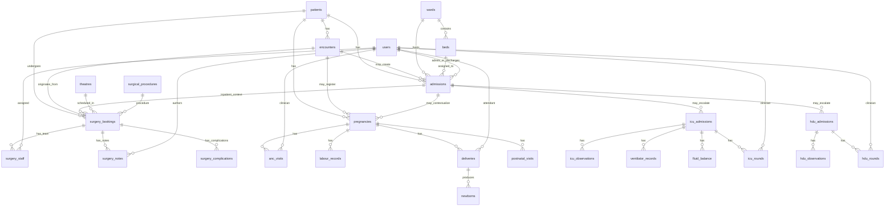

# Future Clinical Modules Architecture

Status: architecture-only design. Do not implement tables, migrations, endpoints, or UI for these modules until their build phase is explicitly started.

This project currently uses NestJS + TypeORM + PostgreSQL, not Prisma. The schema below is written as a database/entity design that can be translated to TypeORM entities and migrations later. If Prisma is introduced in a future branch, these relationships map directly to Prisma models.

## Existing anchors already in the system

The current database foundation already supports the required extension points:

- `patients`: one patient can have many visits, admissions, procedures, pregnancies, ICU/HDU records.
- `encounters`: the visit/episode anchor. Existing values include OPD, emergency, and inpatient.
- `admissions`: inpatient stay anchor. Each admission links to patient, encounter, ward, bed, and users.
- `wards`: already supports `general`, `maternity`, `icu`, and `hdu` ward types.
- `beds`: already supports ICU and maternity bed types.
- `users`: staff anchor for doctors, surgeons, nurses, anesthetists, theatre staff, midwives, and ICU/HDU clinicians.

Important implication: Theatre, Maternity, ICU, and HDU can be added without restructuring the current patient/visit/admission model.

## Core relationship rules

- A patient may have many encounters.
- A patient may have many admissions.
- An admission belongs to exactly one patient.
- An admission may belong to a general ward, maternity ward, ICU, or HDU through `admissions.ward_id -> wards.id`.
- A patient may undergo many surgical procedures.
- A patient may have many pregnancies.
- Every future clinical module must connect back to:
  - `patients`
  - `encounters`
  - `admissions` where applicable
  - `users`

## High-level ERD

## Theatre module design

Purpose: manage surgical procedures and theatre operations.

### Future tables

#### `theatres`

Stores operating rooms.

Relationships:

- `theatres` has many `surgery_bookings`.

Key fields:

- `id`
- `name`
- `code`
- `location`
- `status`: `available`, `in_use`, `maintenance`, `closed`
- audit columns

#### `surgical_procedures`

Procedure catalogue.

Relationships:

- `surgical_procedures` has many `surgery_bookings`.

Key fields:

- `id`
- `name`
- `code`
- `category`
- `description`
- `expected_duration_minutes`
- `active`
- audit columns

#### `surgery_bookings`

The core surgical episode.

Relationships:

- belongs to `patients`
- optionally belongs to `encounters`
- optionally belongs to `admissions`
- belongs to `surgical_procedures`
- optionally belongs to `theatres`
- has many `surgery_staff`
- has many `surgery_notes`
- has many `surgery_complications`

Key fields:

- `id`
- `booking_no`
- `patient_id`
- `encounter_id`
- `admission_id`
- `procedure_id`
- `theatre_id`
- `scheduled_start_at`
- `scheduled_end_at`
- `actual_start_at`
- `actual_end_at`
- `priority`: `elective`, `urgent`, `emergency`
- `status`: `requested`, `scheduled`, `pre_op`, `in_theatre`, `recovery`, `completed`, `cancelled`
- `consent_status`: `not_required`, `pending`, `signed`, `withdrawn`
- `checklist_status`: `pending`, `complete`
- `created_by`
- audit columns

#### `surgery_staff`

Surgical team assignments.

Relationships:

- belongs to `surgery_bookings`
- belongs to `users`

Key fields:

- `id`
- `surgery_booking_id`
- `user_id`
- `role`: `primary_surgeon`, `assistant_surgeon`, `anesthetist`, `theatre_nurse`, `scrub_nurse`, `circulating_nurse`
- `assigned_at`
- audit columns

#### `surgery_notes`

Pre-op, intra-op, operation, post-op, and recovery documentation.

Relationships:

- belongs to `surgery_bookings`
- belongs to author `users`
- may amend another `surgery_notes` row

Key fields:

- `id`
- `surgery_booking_id`
- `author_id`
- `type`: `pre_op_assessment`, `consent`, `checklist`, `intraoperative`, `operation`, `findings`, `post_op`, `recovery`
- `body`
- `amends_note_id`
- `amendment_reason`
- audit columns

Design rule:

- Notes should follow the same immutable-note rule as clinical notes. Corrections are amendments, not edits.

#### `surgery_complications`

Complication documentation.

Relationships:

- belongs to `surgery_bookings`
- belongs to reporting `users`

Key fields:

- `id`
- `surgery_booking_id`
- `reported_by`
- `severity`: `minor`, `moderate`, `severe`, `sentinel`
- `description`
- `action_taken`
- `occurred_at`
- audit columns

## Maternity module design

Purpose: manage antenatal, labour, delivery, newborn, and postnatal care.

### Future tables

#### `pregnancies`

Pregnancy anchor record.

Relationships:

- belongs to `patients`
- optionally belongs to registration `encounters`
- optionally links to an `admissions` row for maternity admission
- has many `anc_visits`
- has many `labour_records`
- has many `deliveries`
- has many `postnatal_visits`

Key fields:

- `id`
- `pregnancy_no`
- `patient_id`
- `registration_encounter_id`
- `admission_id`
- `gravida`
- `para`
- `lmp_date`
- `edd`
- `risk_level`: `low`, `moderate`, `high`
- `risk_notes`
- `status`: `active`, `delivered`, `ended`, `transferred`
- audit columns

#### `anc_visits`

Antenatal care visits.

Relationships:

- belongs to `pregnancies`
- optionally belongs to `encounters`
- belongs to clinician `users`

Key fields:

- `id`
- `pregnancy_id`
- `encounter_id`
- `clinician_id`
- `visit_date`
- `gestational_age_weeks`
- `blood_pressure_systolic`
- `blood_pressure_diastolic`
- `weight`
- `fundal_height`
- `fetal_heart_rate`
- `presentation`
- `risk_assessment`
- `plan`
- audit columns

#### `labour_records`

Labour monitoring.

Relationships:

- belongs to `pregnancies`
- optionally belongs to `admissions`
- belongs to recorder `users`

Key fields:

- `id`
- `pregnancy_id`
- `admission_id`
- `recorded_by`
- `recorded_at`
- `cervical_dilation_cm`
- `contractions`
- `fetal_heart_rate`
- `membranes_status`
- `maternal_pulse`
- `maternal_bp`
- `notes`
- audit columns

#### `deliveries`

Delivery event.

Relationships:

- belongs to `pregnancies`
- optionally belongs to `admissions`
- belongs to attendant `users`
- has many `newborns`

Key fields:

- `id`
- `pregnancy_id`
- `admission_id`
- `attendant_id`
- `delivery_time`
- `mode`: `svd`, `assisted`, `cesarean`, `breech`
- `outcome`: `live_birth`, `stillbirth`, `maternal_transfer`, `maternal_death`
- `complications`
- `blood_loss_ml`
- `notes`
- audit columns

#### `newborns`

Birth records and APGAR scores.

Relationships:

- belongs to `deliveries`
- optionally references registered baby `patients` row if newborn registration creates a patient record

Key fields:

- `id`
- `delivery_id`
- `baby_patient_id`
- `sex`
- `birth_weight_grams`
- `apgar_1_min`
- `apgar_5_min`
- `apgar_10_min`
- `resuscitation_required`
- `status`: `alive`, `stillborn`, `referred`, `deceased`
- audit columns

#### `postnatal_visits`

Mother/baby postnatal follow-up.

Relationships:

- belongs to `pregnancies`
- optionally belongs to `encounters`
- belongs to clinician `users`

Key fields:

- `id`
- `pregnancy_id`
- `encounter_id`
- `clinician_id`
- `visit_date`
- `mother_condition`
- `newborn_condition`
- `feeding_status`
- `danger_signs`
- `plan`
- audit columns

## ICU module design

Purpose: manage intensive care admissions, critical monitoring, ventilation, fluid balance, and ICU rounds.

### Future tables

#### `icu_admissions`

ICU-specific layer over a normal admission.

Relationships:

- belongs to `admissions`
- belongs to `patients` through admission, but keep optional direct `patient_id` for query performance if needed.
- belongs to admitting/accepting `users`
- has many `icu_observations`
- has many `ventilator_records`
- has many `fluid_balance`
- has many `icu_rounds`

Key fields:

- `id`
- `admission_id`
- `accepted_by`
- `icu_bed_id`
- `admitted_to_icu_at`
- `reason`
- `severity_score`
- `status`: `active`, `transferred_out`, `discharged`, `died`
- `discharged_from_icu_at`
- audit columns

#### `icu_observations`

Critical monitoring, usually hourly or more frequent.

Relationships:

- belongs to `icu_admissions`
- belongs to recorder `users`

Key fields:

- `id`
- `icu_admission_id`
- `recorded_by`
- `recorded_at`
- `heart_rate`
- `respiratory_rate`
- `bp_systolic`
- `bp_diastolic`
- `map`
- `spo2`
- `temperature`
- `gcs`
- `pupils`
- `vasopressor_support`
- `notes`
- audit columns

#### `ventilator_records`

Ventilator tracking.

Relationships:

- belongs to `icu_admissions`
- belongs to recorder `users`

Key fields:

- `id`
- `icu_admission_id`
- `recorded_by`
- `recorded_at`
- `mode`
- `fio2`
- `peep`
- `tidal_volume`
- `respiratory_rate_set`
- `pressure_support`
- `plateau_pressure`
- `notes`
- audit columns

#### `fluid_balance`

Fluid input/output chart.

Relationships:

- belongs to `icu_admissions`
- belongs to recorder `users`

Key fields:

- `id`
- `icu_admission_id`
- `recorded_by`
- `recorded_at`
- `input_type`
- `input_volume_ml`
- `output_type`
- `output_volume_ml`
- `net_balance_ml`
- `notes`
- audit columns

#### `icu_rounds`

ICU ward-round notes.

Relationships:

- belongs to `icu_admissions`
- belongs to clinician `users`

Key fields:

- `id`
- `icu_admission_id`
- `clinician_id`
- `round_time`
- `assessment`
- `plan`
- `escalation_decision`
- audit columns

## HDU module design

Purpose: manage High Dependency Unit patients requiring closer monitoring than the general ward but not full ICU.

### Future tables

#### `hdu_admissions`

HDU-specific layer over a normal admission.

Relationships:

- belongs to `admissions`
- belongs to accepting `users`
- has many `hdu_observations`
- has many `hdu_rounds`

Key fields:

- `id`
- `admission_id`
- `accepted_by`
- `hdu_bed_id`
- `admitted_to_hdu_at`
- `reason`
- `status`: `active`, `transferred_out`, `discharged`, `died`
- `discharged_from_hdu_at`
- audit columns

#### `hdu_observations`

Close-monitoring chart.

Relationships:

- belongs to `hdu_admissions`
- belongs to recorder `users`

Key fields:

- `id`
- `hdu_admission_id`
- `recorded_by`
- `recorded_at`
- `heart_rate`
- `respiratory_rate`
- `bp_systolic`
- `bp_diastolic`
- `spo2`
- `temperature`
- `oxygen_support`
- `consciousness_level`
- `escalation_required`
- `notes`
- audit columns

#### `hdu_rounds`

HDU clinical rounds.

Relationships:

- belongs to `hdu_admissions`
- belongs to clinician `users`

Key fields:

- `id`
- `hdu_admission_id`
- `clinician_id`
- `round_time`
- `assessment`
- `plan`
- `escalation_decision`
- audit columns

## Backend extension points

Future implementation should add one Nest module per domain:

- `TheatreModule`
- `MaternityModule`
- `IcuModule`
- `HduModule`

Each module should follow the current project pattern:

- TypeORM entities in `<module>/<module>.entities.ts`
- DTOs in `<module>/<module>.dto.ts`
- service layer with business rules
- controller layer with versioned REST endpoints
- migrations for every table
- permission seed entries
- role-permission seed entries
- audit via the existing global interceptor
- no direct cross-module table reads outside service interfaces where avoidable

## Permission namespace plan

Suggested future permissions:

### Theatre

- `theatres:manage`
- `theatres:read`
- `surgery_bookings:create`
- `surgery_bookings:read`
- `surgery_bookings:update`
- `surgery_staff:assign`
- `surgery_notes:create`
- `surgery_complications:create`

### Maternity

- `pregnancies:create`
- `pregnancies:read`
- `pregnancies:update`
- `anc_visits:create`
- `labour_records:create`
- `deliveries:create`
- `newborns:create`
- `postnatal_visits:create`

### ICU

- `icu_admissions:create`
- `icu_admissions:read`
- `icu_admissions:update`
- `icu_observations:create`
- `ventilator_records:create`
- `fluid_balance:create`
- `icu_rounds:create`

### HDU

- `hdu_admissions:create`
- `hdu_admissions:read`
- `hdu_admissions:update`
- `hdu_observations:create`
- `hdu_rounds:create`

## Implementation order recommendation

The requested priority says:

1. Inpatient
2. Emergency
3. Theatre
4. Maternity
5. ICU
6. HDU

Current status:

- Inpatient: implemented foundation.
- Emergency: implemented foundation.
- Theatre: architecture only, not implemented.
- Maternity: architecture only, not implemented.
- ICU: architecture only, not implemented.
- HDU: architecture only, not implemented.

Theatre, Maternity, ICU, and HDU should remain architecture-only until explicitly approved for implementation.
